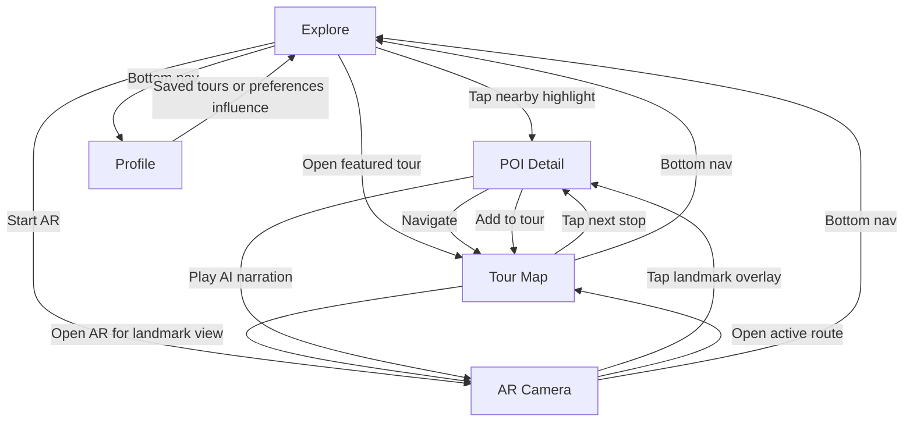
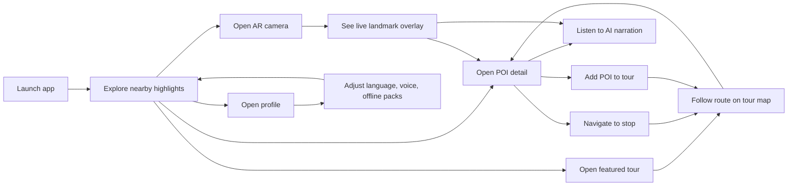
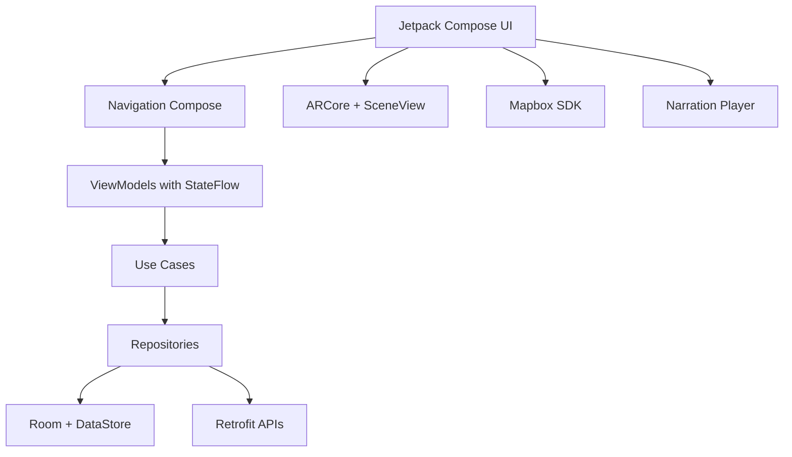
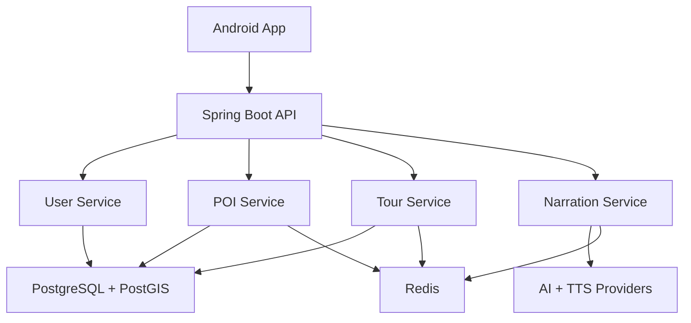
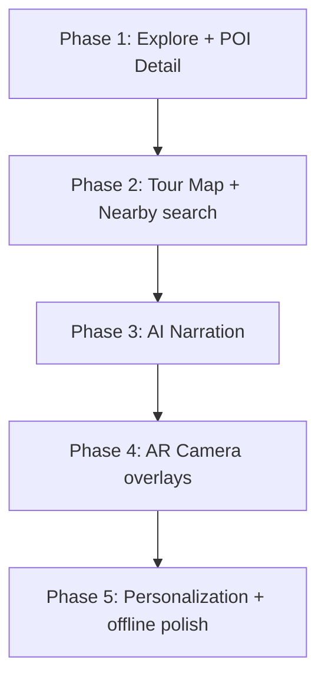

# SmartTour Conception Graphs

These graphs are derived from the preview in [smarttour_app_screens.html](C:/Users/PC/Desktop/smarttour_app_screens.html) and the current SmartTour Kotlin conception.

## 1. App Screen Map

This graph captures the primary navigation structure visible in the preview.

## 2. User Journey Graph

This graph shows the main user journey suggested by the mockups.

## 3. Feature Capability Graph

This graph organizes the preview into feature domains.

```mermaid
graph TB
    SmartTour["SmartTour Mobile App"]

    Explore["Explore Feature"]
    Tour["Tour Feature"]
    AR["AR Feature"]
    Narration["Narration Feature"]
    Profile["Profile Feature"]

    SmartTour --> Explore
    SmartTour --> Tour
    SmartTour --> AR
    SmartTour --> Narration
    SmartTour --> Profile

    Explore --> ExploreA["Nearby highlights"]
    Explore --> ExploreB["Featured tours"]
    Explore --> ExploreC["Search places"]

    Tour --> TourA["Active route"]
    Tour --> TourB["Waypoints"]
    Tour --> TourC["Next stop guidance"]

    AR --> ARA["Camera view"]
    AR --> ARB["Landmark overlay cards"]
    AR --> ARC["Distance and era context"]

    Narration --> N1["AI story generation"]
    Narration --> N2["Audio playback"]
    Narration --> N3["Narration entry from AR and detail"]

    Profile --> P1["Traveler stats"]
    Profile --> P2["Language and voice"]
    Profile --> P3["Offline packs"]
```

## 4. Android Conception Graph

This graph connects the visible screens to the Kotlin Android implementation direction.

## 5. Backend Conception Graph

This graph mirrors the mobile experience with Spring Boot services.

## 6. MVP Conception Sequence

This graph suggests the safest build order from the preview.

## Notes

- The preview indicates `POI detail` is the central pivot screen between discovery, route guidance, and narration.
- `AR camera` should be treated as an advanced surface layered on top of existing POI and tour data, not as the first implemented feature.
- `Profile` is mostly a settings and personalization boundary rather than a discovery surface.
- `Narration` is a cross-cutting capability triggered from both AR and POI detail.
